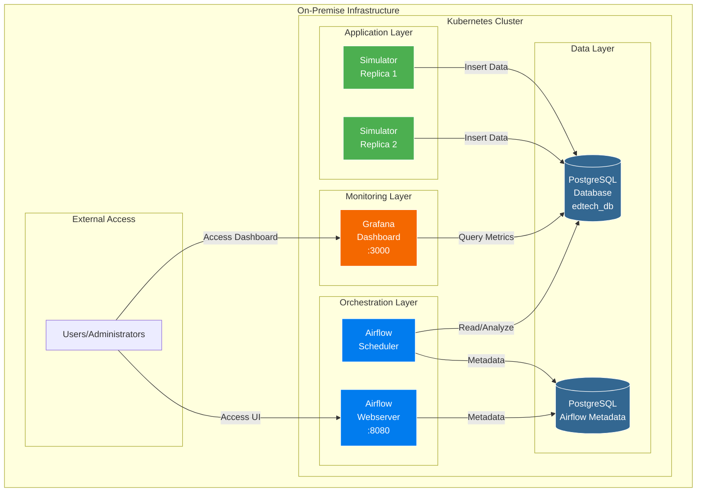
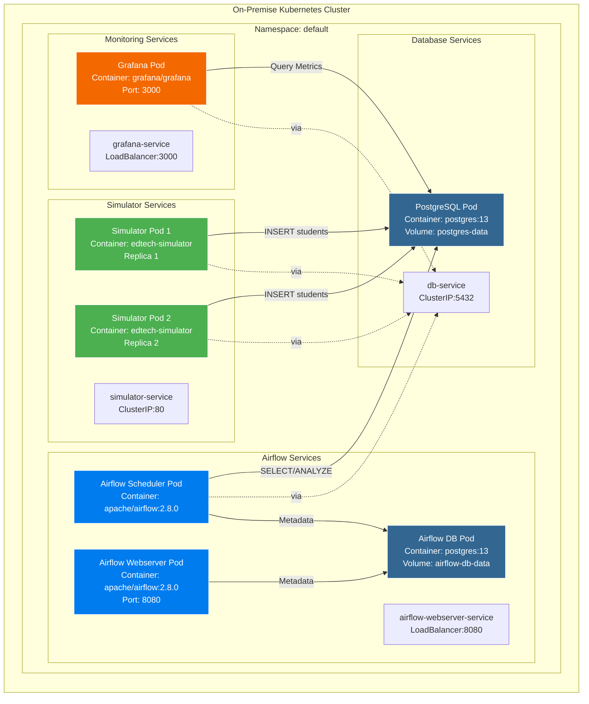
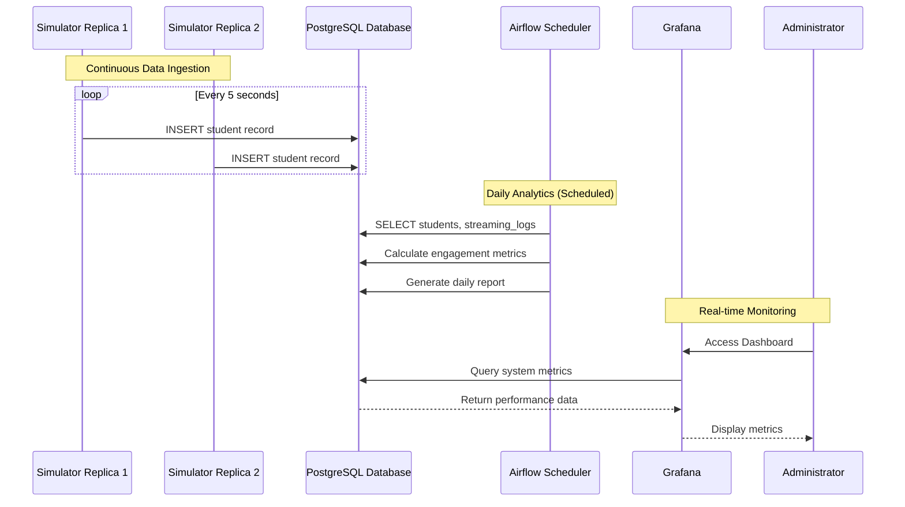
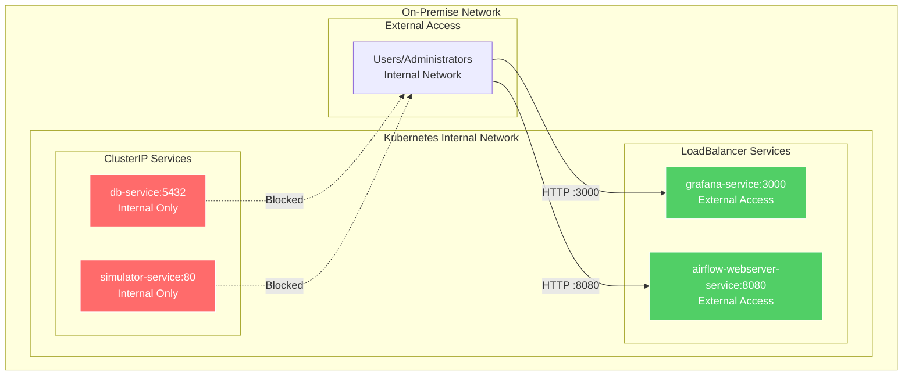
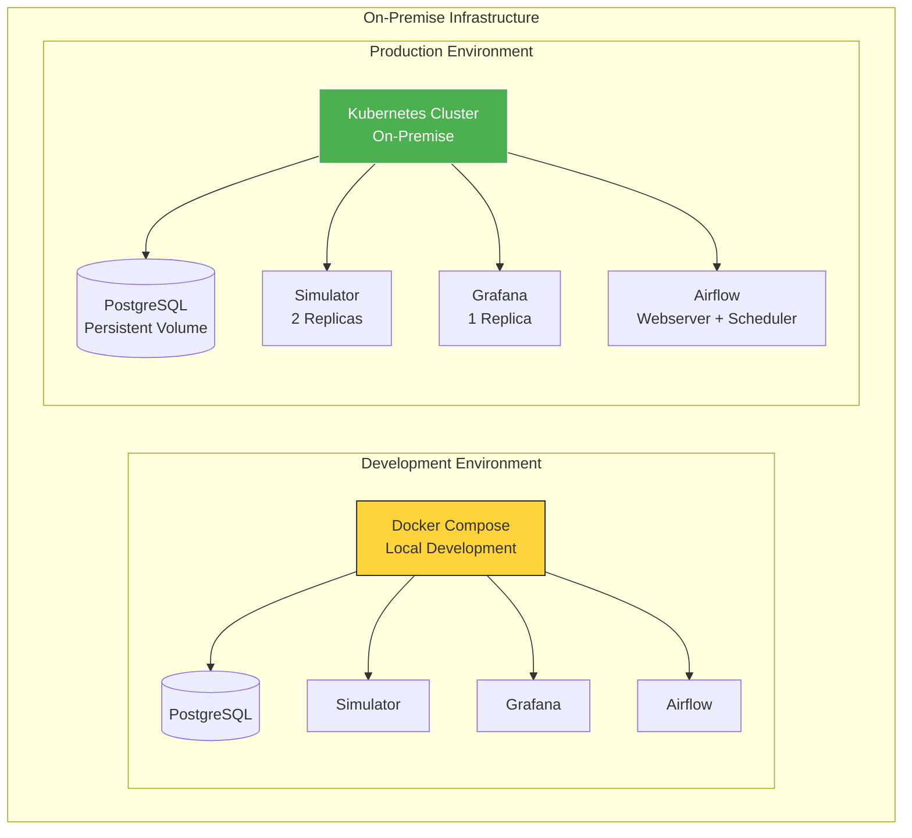

# Architecture Requirements Document
## EdTech Stream Automation Platform

**Project:** EdTech Stream Automation
**Deployment Environment:** **On-Premise**

---

## 1. Executive Summary

This document describes the architecture of the EdTech Stream Automation platform, an on-premise data infrastructure solution for educational streaming analytics. The platform simulates student streaming behavior, captures engagement events, stores data in PostgreSQL, runs automated analytics with Apache Airflow, and provides observability through Grafana and Prometheus.

**Deployment Approach:**
- **Development:** Docker Compose for local testing and rapid iteration
- **Production:** Kubernetes on on-premise infrastructure
- **Optional Infrastructure Provisioning:** Terraform example for AWS EC2

---

## 2. Business Objectives

### 2.1 Goals

1. **Data Collection & Simulation**
   - Generate realistic student streaming events for analytics
   - Maintain continuous data ingestion
   - Support multiple classrooms and lesson types

2. **Analytics & Reporting**
   - Execute scheduled analytics workflows daily
   - Track lesson completion and student engagement
   - Provide insights for educators and administrators

3. **Monitoring & Reliability**
   - Measure service health and performance in real time
   - Alert on critical failures and resource issues
   - Ensure operational stability across the infrastructure

4. **Scalability & Maintainability**
   - Scale simulation horizontally
   - Enable repeatable deployments with infrastructure as code
   - Keep the architecture easy to extend and maintain

### 2.2 Stakeholders

- **Educators:** Need engagement metrics and lesson effectiveness reports
- **Administrators:** Require monitoring and reliability controls
- **Data Engineers:** Need reliable pipelines, storage, and analytics automation
- **Developers:** Need simple deployment, monitoring, and observability

---

## 3. Architecture Overview

The system is designed as a modular container-based platform with the following layers:

- **Data Layer:** PostgreSQL for application and metadata storage
- **Ingestion Layer:** Simulator container generating streaming events
- **Orchestration Layer:** Apache Airflow for scheduled analytics workflows
- **Observability Layer:** Grafana dashboards and Prometheus metrics
- **Infrastructure Layer:** Docker Compose for local use, Kubernetes for production

Key design principles:
- **Containerization:** All services run in containers for consistency
- **Separation of concerns:** Each component has a focused responsibility
- **Observability:** Monitoring and alerts are integral to the architecture
- **On-premise deployment:** Designed to run inside private infrastructure without cloud dependency

---

## 4. Architecture Diagrams

### 4.1 High-Level Architecture

### 4.2 Detailed Component Architecture

### 4.3 Data Flow Architecture

### 4.4 Network Architecture

### 4.5 Deployment Architecture

---

## 5. System Components

### 5.1 Core Services

1. **PostgreSQL Database**
   - Stores: students, lessons, streaming_logs
   - Purpose: persistent storage and analytics queries
   - Access: internal network only

2. **EdTech Simulator**
   - Generates: student and streaming event records
   - Frequency: every 5 seconds
   - Purpose: continuous ingestion for analytics testing

3. **Apache Airflow**
   - Components: webserver, scheduler, metadata database
   - Purpose: orchestrates analytics DAGs and reporting
   - Schedule: daily job execution

4. **Grafana**
   - Purpose: visualization and dashboard monitoring
   - Port: 3000
   - Includes: pre-provisioned dashboards and datasources

5. **Prometheus**
   - Purpose: metric collection and alert evaluation
   - Port: 9090
   - Scrapes: PostgreSQL, Airflow, Docker, and self metrics

6. **Terraform / AWS EC2**
   - Purpose: optional infrastructure provisioning example
   - Deploys: single EC2 instance with Docker bootstrap

---

## 6. Non-Functional Requirements

### 6.1 Performance

- Support at least 12 records per minute per simulator replica
- Maintain dashboard queries under 2 seconds
- Complete analytics DAG runs within 5 minutes

### 6.2 Scalability

- Support horizontal scaling of simulator replicas
- Provide database scaling options through resource allocation
- Use Kubernetes load balancing for production services

### 6.3 Reliability

- Target 99.5% uptime
- Restart failed containers automatically
- Preserve data with persistent volumes

### 6.4 Maintainability

- Document architecture and deployment clearly
- Keep code modular and easy to extend
- Use environment variables for configuration

---

## 7. Risk Assessment & Mitigation

### 7.1 Infrastructure Risks

- **Database failure**: use persistent volumes and restart policies
- **High data volume**: apply indexes and optimize queries
- **Dependency failure**: implement health checks and retries
- **Resource exhaustion**: set limits and monitor usage

### 7.2 Security Risks

- **Exposed credentials**: avoid hardcoded passwords and use environment variables
- **Network exposure**: lock down internal services and limit external ports

---

## 8. Future Considerations

- Add real-time stream processing with Kafka or similar
- Extend monitoring with node_exporter and alertmanager
- Add a separate analytics warehouse for reporting
- Implement API access for external integrations
- Add stronger authentication and authorization

---

## 9. Conclusion

This architecture document now combines requirements, design decisions, diagrams, and deployment patterns for the EdTech Stream Automation platform. The solution supports a full on-premise deployment model with Docker Compose for development and Kubernetes for production, while preserving a strong focus on observability, scalability, and maintainability.

The design supports:
- **Reliable data ingestion**
- **Daily analytics workflows**
- **Monitoring and alerting**
- **Scalable on-premise deployment**
- **Clear separation between development and production environments**

This architecture is ready to support the current project requirements and future growth.
