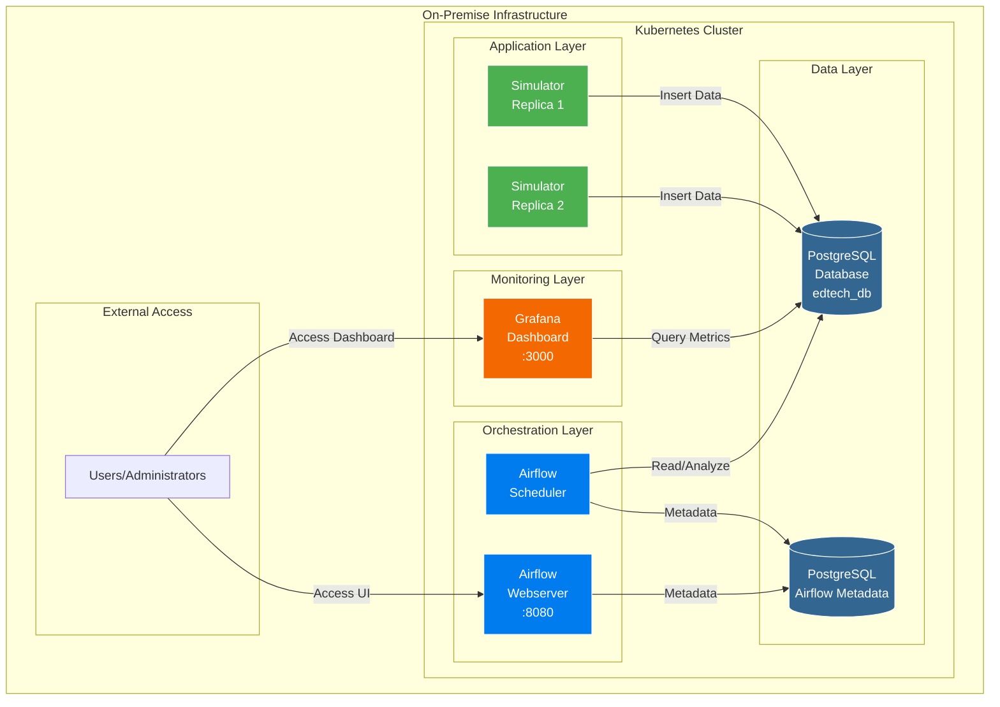
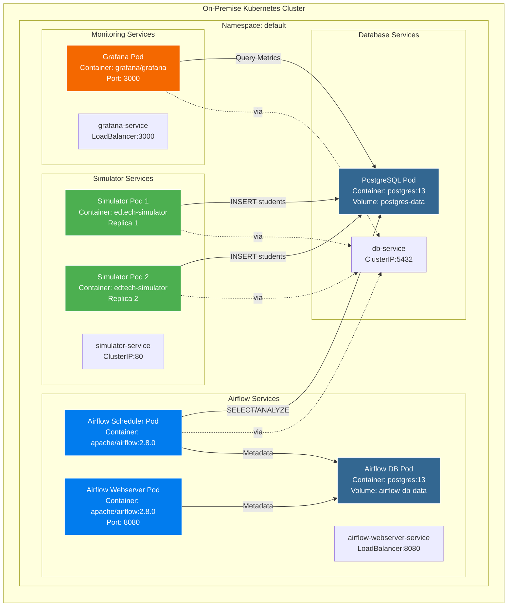
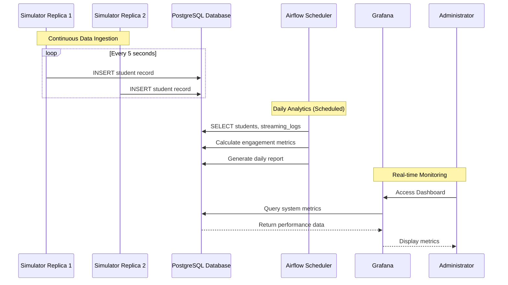
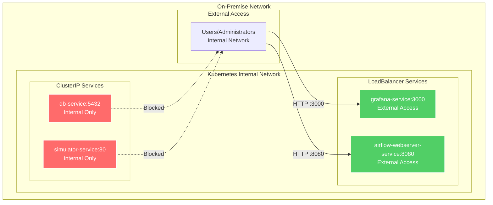
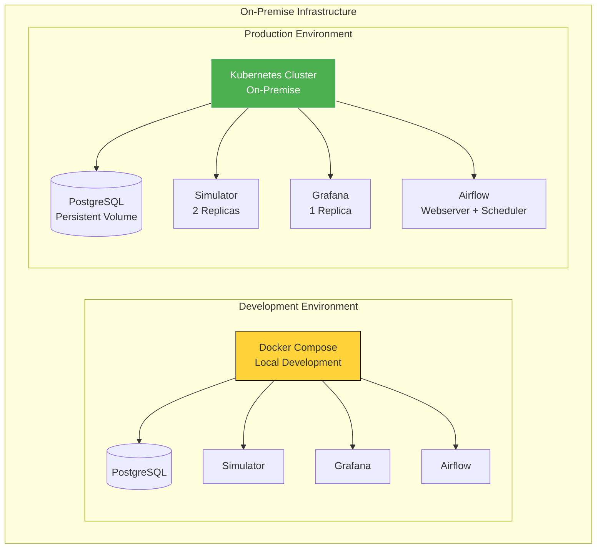

# Architecture Diagram
## EdTech Stream Automation Platform

## System Architecture Overview

This document contains visual architecture diagrams for the EdTech Stream Automation platform.

---

## 1. High-Level Architecture Diagram

### Mermaid Diagram (for GitHub/Markdown)

---

## 2. Detailed Component Architecture

### Mermaid Diagram

---

## 3. Data Flow Architecture

### Mermaid Diagram

---

## 4. Network Architecture

### Mermaid Diagram

---

## 5. Deployment Architecture

### Mermaid Diagram

---

## 6. Text-Based Architecture Description (for PowerPoint/Google Slides)

### Slide 1: System Overview

**Title:** EdTech Stream Automation - System Architecture

**Components:**
- **Data Layer:** PostgreSQL Database (edtech_db)
- **Application Layer:** EdTech Simulator (2 replicas)
- **Orchestration Layer:** Apache Airflow (Webserver + Scheduler)
- **Monitoring Layer:** Grafana Dashboard
- **Infrastructure:** On-Premise Kubernetes Cluster

### Slide 2: Component Details

**PostgreSQL Database:**
- Stores: students, lessons, streaming_logs
- Port: 5432 (internal only)
- Persistent Volume: 10GB

**EdTech Simulator:**
- Replicas: 2
- Function: Continuous data generation
- Rate: 12 records/min per replica

**Apache Airflow:**
- Webserver: Port 8080 (external access)
- Scheduler: Daily analytics DAG execution
- Database: Separate PostgreSQL for metadata

**Grafana:**
- Port: 3000 (external access)
- Function: System performance monitoring
- Dashboards: Pre-provisioned

### Slide 3: Data Flow

1. **Data Ingestion:**
   - Simulator replicas insert student records every 5 seconds
   - Data stored in PostgreSQL database

2. **Analytics Processing:**
   - Airflow scheduler runs daily DAG
   - Analyzes student engagement, lesson completion, classroom performance
   - Generates daily reports

3. **Monitoring:**
   - Grafana queries database for system metrics
   - Real-time dashboard updates
   - Performance and health monitoring

### Slide 4: Network Architecture

**Internal Services (ClusterIP):**
- Database: db-service:5432
- Simulator: simulator-service:80

**External Services (LoadBalancer):**
- Grafana: grafana-service:3000
- Airflow: airflow-webserver-service:8080

**Security:**
- Database not exposed externally
- Internal network communication only
- External access limited to monitoring and orchestration UIs

### Slide 5: Deployment Environments

**Development:**
- Docker Compose
- Local machine deployment
- All services in single compose file

**Production:**
- Kubernetes cluster
- On-premise infrastructure
- High availability with replicas
- Persistent storage for databases

---

## 7. How to Use These Diagrams

### Option 1: Mermaid (Recommended)
1. Copy the Mermaid code blocks
2. Paste into:
   - GitHub Markdown files (renders automatically)
   - Mermaid Live Editor: https://mermaid.live
   - VS Code with Mermaid extension
   - Any Markdown viewer that supports Mermaid

### Option 2: PowerPoint/Google Slides
1. Use the text descriptions in Section 6
2. Create slides with the component information
3. Use shapes and arrows to create visual diagrams
4. Recommended tools:
   - PowerPoint: Insert > SmartArt or Shapes
   - Google Slides: Insert > Diagram
   - Draw.io: https://app.diagrams.net (free online)

### Option 3: Export from Mermaid
1. Go to https://mermaid.live
2. Paste Mermaid code
3. Export as PNG, SVG, or PDF
4. Insert into PowerPoint/Google Slides

---

## 8. Visual Elements Guide

**Color Coding:**
- **Blue (#336791):** Database services
- **Green (#4CAF50):** Application/Simulator services
- **Orange (#F46800):** Monitoring/Grafana
- **Light Blue (#017CEE):** Orchestration/Airflow
- **Red (#ff6b6b):** Internal-only services
- **Green (#51cf66):** External-accessible services

**Shapes:**
- **Cylinder:** Database/Persistent Storage
- **Rectangle:** Application Services
- **Rounded Rectangle:** Kubernetes Pods
- **Cloud:** Network/Infrastructure

---

**Document Status:** Complete  
**Last Updated:** January 2025  
**Format:** Mermaid diagrams + Text descriptions for PowerPoint/Google Slides

