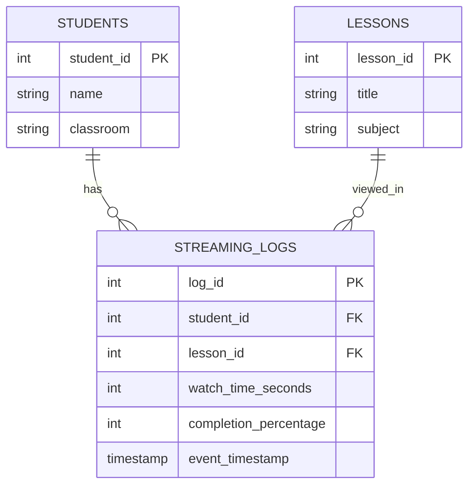

# Data Model Documentation
## EdTech Stream Automation Platform

## 1. Logical Data Model (ER Diagram)

### Entity-Relationship Diagram

#### Mermaid ER Diagram (for GitHub/Markdown)


```mermaid
erDiagram
    STUDENTS {
        int student_id PK
        string name
        string classroom
    }
    
    LESSONS {
        int lesson_id PK
        string title
        string subject
    }
    
    STREAMING_LOGS {
        int log_id PK
        int student_id FK
        int lesson_id FK
        int watch_time_seconds
        int completion_percentage
        timestamp event_timestamp
    }
    
    STUDENTS ||--o{ STREAMING_LOGS : "has"
    LESSONS ||--o{ STREAMING_LOGS : "viewed_in"
```

---

## 2. Entity Descriptions

### 2.1 STUDENTS Entity

**Description:** Stores information about students enrolled in the EdTech platform.

| Attribute | Type | Constraints | Description |
|-----------|------|-------------|-------------|
| `student_id` | SERIAL (INTEGER) | PRIMARY KEY, NOT NULL, AUTO_INCREMENT | Unique identifier for each student |
| `name` | VARCHAR(100) | NOT NULL | Student's full name |
| `classroom` | VARCHAR(50) | NOT NULL | Classroom/cohort assignment (e.g., Data_2025, IA_2025) |

**Primary Key:** `student_id`  
**Relationships:**
- One-to-Many with STREAMING_LOGS (one student can have many streaming events)

**Example Data:**
```
student_id | name     | classroom
-----------|----------|-----------
1          | Mariama  | Data_2025
2          | Boubacar | Data_2025
3          | Alice    | IA_2025
```

---

### 2.2 LESSONS Entity

**Description:** Stores metadata about educational video lessons available on the platform.

| Attribute | Type | Constraints | Description |
|-----------|------|-------------|-------------|
| `lesson_id` | SERIAL (INTEGER) | PRIMARY KEY, NOT NULL, AUTO_INCREMENT | Unique identifier for each lesson |
| `title` | VARCHAR(200) | NOT NULL | Lesson title/name |
| `subject` | VARCHAR(100) | NOT NULL | Subject category (e.g., DevOps, Data Engineering) |

**Primary Key:** `lesson_id`  
**Relationships:**
- One-to-Many with STREAMING_LOGS (one lesson can be viewed by many students)

**Example Data:**
```
lesson_id | title                  | subject
----------|------------------------|------------------
1         | Introduction à Docker  | DevOps
2         | Maîtriser Airflow      | Data Engineering
```

---

### 2.3 STREAMING_LOGS Entity

**Description:** Records individual streaming events when students watch lessons. This is the fact table that captures student engagement data.

| Attribute | Type | Constraints | Description |
|-----------|------|-------------|-------------|
| `log_id` | SERIAL (INTEGER) | PRIMARY KEY, NOT NULL, AUTO_INCREMENT | Unique identifier for each streaming event |
| `student_id` | INTEGER | FOREIGN KEY, NOT NULL | References STUDENTS.student_id |
| `lesson_id` | INTEGER | FOREIGN KEY, NOT NULL | References LESSONS.lesson_id |
| `watch_time_seconds` | INTEGER | NULL | Total time student watched the lesson (in seconds) |
| `completion_percentage` | INTEGER | NULL | Percentage of lesson completed (0-100) |
| `event_timestamp` | TIMESTAMP | NOT NULL, DEFAULT CURRENT_TIMESTAMP | When the streaming event occurred |

**Primary Key:** `log_id`  
**Foreign Keys:**
- `student_id` → STUDENTS.student_id
- `lesson_id` → LESSONS.lesson_id

**Relationships:**
- Many-to-One with STUDENTS (many streaming events belong to one student)
- Many-to-One with LESSONS (many streaming events reference one lesson)

**Example Data:**
```
log_id | student_id | lesson_id | watch_time_seconds | completion_percentage | event_timestamp
-------|------------|-----------|-------------------|---------------------|------------------
1      | 1          | 1         | 1200              | 85                   | 2025-01-15 10:30:00
2      | 1          | 2         | 900               | 60                   | 2025-01-15 14:20:00
3      | 2          | 1         | 1500              | 100                  | 2025-01-15 11:15:00
```

---

## 3. Relationship Details

### 3.1 STUDENTS ↔ STREAMING_LOGS

**Relationship Type:** One-to-Many (1:N)

**Cardinality:**
- One STUDENT can have zero or many STREAMING_LOGS
- Each STREAMING_LOG belongs to exactly one STUDENT

**Business Rule:**
- A student can watch multiple lessons, creating multiple streaming log entries
- A student may not have watched any lessons yet (optional participation)

**Foreign Key Constraint:**
```sql
ALTER TABLE streaming_logs 
ADD CONSTRAINT fk_student 
FOREIGN KEY (student_id) 
REFERENCES students(student_id);
```

### 3.2 LESSONS ↔ STREAMING_LOGS

**Relationship Type:** One-to-Many (1:N)

**Cardinality:**
- One LESSON can be viewed by zero or many students (creating multiple STREAMING_LOGS)
- Each STREAMING_LOG references exactly one LESSON

**Business Rule:**
- A lesson can be watched by multiple students
- A lesson may not have been viewed yet (new lesson)

**Foreign Key Constraint:**
```sql
ALTER TABLE streaming_logs 
ADD CONSTRAINT fk_lesson 
FOREIGN KEY (lesson_id) 
REFERENCES lessons(lesson_id);
```

---

## 4. Physical Data Model

### 4.1 Database Schema

The physical implementation uses PostgreSQL 13 with the following characteristics:

**Database Name:** `edtech_db`

**Tables:**
1. `students` - Student information
2. `lessons` - Lesson metadata
3. `streaming_logs` - Streaming event facts

### 4.2 Table Definitions

#### STUDENTS Table
```sql
CREATE TABLE students (
    student_id SERIAL PRIMARY KEY,
    name VARCHAR(100) NOT NULL,
    classroom VARCHAR(50) NOT NULL
);
```

#### LESSONS Table
```sql
CREATE TABLE lessons (
    lesson_id SERIAL PRIMARY KEY,
    title VARCHAR(200) NOT NULL,
    subject VARCHAR(100) NOT NULL
);
```

#### STREAMING_LOGS Table
```sql
CREATE TABLE streaming_logs (
    log_id SERIAL PRIMARY KEY,
    student_id INT NOT NULL REFERENCES students(student_id),
    lesson_id INT NOT NULL REFERENCES lessons(lesson_id),
    watch_time_seconds INT,
    completion_percentage INT,
    event_timestamp TIMESTAMP DEFAULT CURRENT_TIMESTAMP
);
```

### 4.3 Indexes

**Recommended Indexes for Performance:**
```sql
-- Index on foreign keys for faster JOINs
CREATE INDEX idx_streaming_logs_student_id ON streaming_logs(student_id);
CREATE INDEX idx_streaming_logs_lesson_id ON streaming_logs(lesson_id);

-- Index on timestamp for time-series queries (Grafana)
CREATE INDEX idx_streaming_logs_timestamp ON streaming_logs(event_timestamp);

-- Index on classroom for analytics queries
CREATE INDEX idx_students_classroom ON students(classroom);
```

---

## 5. Star Schema Design

### 5.1 Star Schema Overview

The EdTech data model follows a **star schema** design pattern, optimized for analytics and business intelligence queries. The star schema consists of:

- **1 Fact Table:** `STREAMING_LOGS` (center of the star)
- **2 Dimension Tables:** `STUDENTS`, `LESSONS` (points of the star)

**Why Star Schema?**
- ✅ Simplified queries: Easy denormalization for analytics
- ✅ Query performance: Fewer JOINs required for common analytical queries
- ✅ Intuitive structure: Dimensions describe WHO (students), WHAT (lessons), WHEN (time), and FACTS measure engagement
- ✅ BI-friendly: Grafana, Tableau, and other BI tools work seamlessly with star schemas
- ✅ OLAP optimization: Fast multidimensional analysis

### 5.2 Fact Table: STREAMING_LOGS

**Purpose:** Records individual streaming events (facts) of student engagement with lessons.

**Type:** Transactional Fact Table (one row per event)

**Characteristics:**
- Contains foreign keys to dimension tables (student_id, lesson_id)
- Contains quantitative measurements (watch_time_seconds, completion_percentage)
- Each row represents a single observation/event
- Grows incrementally with new streaming events (~1,000+ rows/day with simulator)

**Fact Table Schema:**
```
┌─────────────────────────────┐
│    STREAMING_LOGS (FACT)    │
├─────────────────────────────┤
│ log_id (PK)                │ ← Event surrogate key
│ student_id (FK) ─────────┐  ← Link to student dimension
│ lesson_id (FK) ──────────┼──┐← Link to lesson dimension
│ event_timestamp (FK)    │  │ ← Link to time dimension (implicit)
├─────────────────────────────┤
│ watch_time_seconds    (Measure)
│ completion_percentage (Measure)
└─────────────────────────────┘
```

**Measures (Quantitative Facts):**

| Measure | Type | Description | Aggregation |
|---------|------|-------------|-------------|
| `watch_time_seconds` | INTEGER | Duration student watched the lesson | SUM, AVG, MIN, MAX |
| `completion_percentage` | INTEGER | Percentage of lesson completed | AVG, MIN, MAX, COUNT |
| (implicit) count of events | COUNT | Number of streaming events | SUM |

### 5.3 Dimension Table 1: STUDENTS

**Purpose:** Provides context about WHO is learning.

**Type:** Slowly Changing Dimension (SCD Type 1 - overwrite)

**Characteristics:**
- Describes attributes of students
- Relatively small and stable (grows slowly)
- Referenced by many fact table rows
- Contains textual and categorical attributes

**Dimension Schema:**
```
┌──────────────────────┐
│   STUDENTS (DIM)     │
├──────────────────────┤
│ student_id (PK)     │ ← Dimension key
├──────────────────────┤
│ name                │ ← Attribute (who)
│ classroom           │ ← Attribute (segmentation)
└──────────────────────┘
```

**Dimensions (Descriptive Attributes):**

| Dimension | Type | Description | Usage |
|-----------|------|-------------|-------|
| `student_id` | INTEGER | Student identifier | Primary key, foreign key reference |
| `name` | VARCHAR(100) | Student's name | Filtering, grouping, display |
| `classroom` | VARCHAR(50) | Class/cohort assignment | Segmentation, aggregation, comparison |

**Example Analysis:**
```sql
-- "Which classroom has the highest average completion rate?"
SELECT 
    s.classroom,
    AVG(sl.completion_percentage) as avg_completion_rate
FROM students s
JOIN streaming_logs sl ON s.student_id = sl.student_id
GROUP BY s.classroom
ORDER BY avg_completion_rate DESC;
```

### 5.4 Dimension Table 2: LESSONS

**Purpose:** Provides context about WHAT is being learned.

**Type:** Slowly Changing Dimension (SCD Type 1 - overwrite)

**Characteristics:**
- Describes attributes of lessons/content
- Relatively small and stable
- Referenced by many fact table rows
- Contains textual and categorical attributes

**Dimension Schema:**
```
┌──────────────────────┐
│    LESSONS (DIM)     │
├──────────────────────┤
│ lesson_id (PK)      │ ← Dimension key
├──────────────────────┤
│ title               │ ← Attribute (what content)
│ subject             │ ← Attribute (subject category)
└──────────────────────┘
```

**Dimensions (Descriptive Attributes):**

| Dimension | Type | Description | Usage |
|-----------|------|-------------|-------|
| `lesson_id` | INTEGER | Lesson identifier | Primary key, foreign key reference |
| `title` | VARCHAR(200) | Lesson title/name | Filtering, display, reporting |
| `subject` | VARCHAR(100) | Subject category | Segmentation, aggregation, comparison |

**Example Analysis:**
```sql
-- "Which subject has the highest student engagement?"
SELECT 
    l.subject,
    COUNT(DISTINCT sl.student_id) as unique_students,
    COUNT(sl.log_id) as total_views,
    AVG(sl.watch_time_seconds) as avg_watch_time
FROM lessons l
JOIN streaming_logs sl ON l.lesson_id = sl.lesson_id
GROUP BY l.subject
ORDER BY avg_watch_time DESC;
```

### 5.5 Implicit Time Dimension

**Purpose:** Enables temporal analysis of student engagement.

**Currently Implemented:** `event_timestamp` in STREAMING_LOGS

**Future Enhancement (Optional):** Create explicit `DATE_DIMENSION` table for granular time slicing:
```sql
-- Future DATE_DIMENSION table structure
CREATE TABLE date_dimension (
    date_id SERIAL PRIMARY KEY,
    full_date DATE,
    year INT,
    quarter INT,
    month INT,
    week INT,
    day_of_month INT,
    day_name VARCHAR(10),
    is_weekend BOOLEAN
);
```

### 5.6 Star Schema Visualization

```
                    ┌─────────────┐
                    │  LESSONS    │
                    │  (DIM)      │
                    ├─────────────┤
                    │ lesson_id   │
                    │ title       │
                    │ subject     │
                    └────────┬────┘
                             │
                             │
                    ┌────────▼────────┐
                    │ STREAMING_LOGS  │
                    │   (FACT)        │
    ┌───────────────┤ ┌─────────────┐ ├───────────────┐
    │               │ │ log_id      │ │               │
    │               │ │ student_id◄─┼─┤               │
    │               │ │ lesson_id◄──┤─┤               │
    │               │ │ timestamp   │ │               │
    │               │ │ watch_time  │ │               │
    │               │ │ completion%│ │               │
    │               │ └─────────────┘ │               │
    │               └────────┬────────┘               │
    │                        │                       │
    │                        │                       │
    ┌───────────────────────┘                       │
    │                                                │
┌───┴────────┐                            (Future)
│  STUDENTS  │                          TIME_DIM
│  (DIM)     │                         (Optional)
├────────────┤
│ student_id │
│ name       │
│ classroom  │
└────────────┘
```

**Star Schema Benefits for This Diagram:**
- Central `STREAMING_LOGS` fact table with all measurements
- Direct links to `STUDENTS` and `LESSONS` dimensions
- Minimal JOINs for common queries
- Easy aggregation along multiple dimensions

### 5.7 Typical Star Schema Queries

**Query 1: Classroom Performance Over Time**
```sql
SELECT 
    s.classroom,
    DATE(sl.event_timestamp) as date,
    COUNT(DISTINCT s.student_id) as active_students,
    AVG(sl.completion_percentage) as avg_completion,
    AVG(sl.watch_time_seconds) as avg_watch_time
FROM students s
JOIN streaming_logs sl ON s.student_id = sl.student_id
GROUP BY s.classroom, DATE(sl.event_timestamp)
ORDER BY s.classroom, date;
```

**Query 2: Subject Popularity Analysis**
```sql
SELECT 
    l.subject,
    l.title,
    COUNT(sl.log_id) as total_views,
    COUNT(DISTINCT sl.student_id) as unique_viewers,
    AVG(sl.completion_percentage) as avg_completion
FROM lessons l
LEFT JOIN streaming_logs sl ON l.lesson_id = sl.lesson_id
GROUP BY l.subject, l.title
ORDER BY total_views DESC;
```

**Query 3: Student Engagement Metrics**
```sql
SELECT 
    s.name,
    s.classroom,
    COUNT(sl.log_id) as lessons_watched,
    SUM(sl.watch_time_seconds) as total_watch_time,
    AVG(sl.completion_percentage) as avg_completion
FROM students s
LEFT JOIN streaming_logs sl ON s.student_id = sl.student_id
GROUP BY s.student_id, s.name, s.classroom
ORDER BY total_watch_time DESC;
```

---

## 6. Data Dictionary

### 6.1 Attribute Definitions

| Entity | Attribute | Data Type | Domain | Nullable | Default |
|--------|-----------|-----------|--------|----------|---------|
| STUDENTS | student_id | INTEGER | 1 to 2,147,483,647 | NO | AUTO_INCREMENT |
| STUDENTS | name | VARCHAR(100) | Text, max 100 chars | NO | - |
| STUDENTS | classroom | VARCHAR(50) | Text, max 50 chars | NO | - |
| LESSONS | lesson_id | INTEGER | 1 to 2,147,483,647 | NO | AUTO_INCREMENT |
| LESSONS | title | VARCHAR(200) | Text, max 200 chars | NO | - |
| LESSONS | subject | VARCHAR(100) | Text, max 100 chars | NO | - |
| STREAMING_LOGS | log_id | INTEGER | 1 to 2,147,483,647 | NO | AUTO_INCREMENT |
| STREAMING_LOGS | student_id | INTEGER | Valid student_id | NO | - |
| STREAMING_LOGS | lesson_id | INTEGER | Valid lesson_id | NO | - |
| STREAMING_LOGS | watch_time_seconds | INTEGER | 0 to 2,147,483,647 | YES | NULL |
| STREAMING_LOGS | completion_percentage | INTEGER | 0 to 100 | YES | NULL |
| STREAMING_LOGS | event_timestamp | TIMESTAMP | Valid timestamp | NO | CURRENT_TIMESTAMP |

---

## 7. Business Rules

### 7.1 Data Integrity Rules

1. **Referential Integrity:**
   - A streaming log cannot reference a non-existent student
   - A streaming log cannot reference a non-existent lesson
   - Deleting a student should handle orphaned streaming logs (CASCADE or RESTRICT)

2. **Domain Constraints:**
   - `completion_percentage` must be between 0 and 100 (if not NULL)
   - `watch_time_seconds` must be non-negative (if not NULL)
   - `event_timestamp` must be a valid timestamp

3. **Uniqueness:**
   - Each `student_id` is unique
   - Each `lesson_id` is unique
   - Each `log_id` is unique

### 7.2 Business Logic Rules

1. **Student Enrollment:**
   - Students are automatically assigned a unique ID upon enrollment
   - Students must belong to a classroom

2. **Lesson Management:**
   - Lessons are created independently of students
   - Lessons can exist without any views

3. **Streaming Events:**
   - Each streaming event records one student viewing one lesson
   - Multiple events can exist for the same student-lesson combination
   - Timestamp is automatically recorded when event is created

---

## 8. ER Diagram Visual Representations

### 8.1 Text-Based ER Diagram

```
┌─────────────────┐
│    STUDENTS     │
├─────────────────┤
│ student_id (PK)  │
│ name           │
│ classroom      │
└────────┬────────┘
         │
         │ 1
         │
         │ N
         │
┌────────▼──────────────────┐
│    STREAMING_LOGS         │
├───────────────────────────┤
│ log_id (PK)              │
│ student_id (FK) ──────────┼──┐
│ lesson_id (FK) ──────────┼──┼──┐
│ watch_time_seconds       │  │  │
│ completion_percentage    │  │  │
│ event_timestamp         │  │  │
└──────────────────────────┘  │  │
                               │  │
                               │  │
┌──────────────────────────────┘  │
│         LESSONS                 │
├─────────────────────────────────┤
│ lesson_id (PK)                  │
│ title                          │
│ subject                        │
└─────────────────────────────────┘
```

### 8.2 Relationship Summary

```
STUDENTS (1) ────< (N) STREAMING_LOGS (N) >─── (1) LESSONS
```

**Read as:**
- One STUDENT has many STREAMING_LOGS
- One LESSON has many STREAMING_LOGS
- STREAMING_LOGS is the junction/fact table connecting STUDENTS and LESSONS

---

## 9. Sample Queries Demonstrating Relationships

### 9.1 Query: Get all streaming events for a student
```sql
SELECT 
    s.name,
    s.classroom,
    l.title,
    sl.watch_time_seconds,
    sl.completion_percentage,
    sl.event_timestamp
FROM students s
JOIN streaming_logs sl ON s.student_id = sl.student_id
JOIN lessons l ON sl.lesson_id = l.lesson_id
WHERE s.student_id = 1;
```

### 9.2 Query: Get all students who viewed a lesson
```sql
SELECT 
    s.name,
    s.classroom,
    sl.completion_percentage,
    sl.event_timestamp
FROM lessons l
JOIN streaming_logs sl ON l.lesson_id = sl.lesson_id
JOIN students s ON sl.student_id = s.student_id
WHERE l.lesson_id = 1;
```

### 9.3 Query: Get classroom engagement statistics
```sql
SELECT 
    s.classroom,
    COUNT(DISTINCT s.student_id) as total_students,
    COUNT(sl.log_id) as total_views,
    AVG(sl.completion_percentage) as avg_completion
FROM students s
LEFT JOIN streaming_logs sl ON s.student_id = sl.student_id
GROUP BY s.classroom;
```

---

## 10. Data Model Characteristics

### 10.1 Normalization Level

**Current Normalization:** Third Normal Form (3NF)

**Justification:**
- ✅ No repeating groups
- ✅ All attributes depend on the primary key
- ✅ No transitive dependencies
- ✅ Each entity represents a single concept

### 10.2 Data Volume Estimates

**STUDENTS:**
- Estimated: 1,000 - 10,000 records
- Growth: ~12 records/minute (with 2 simulator replicas)

**LESSONS:**
- Estimated: 50 - 500 records
- Growth: Manual addition (not automated)

**STREAMING_LOGS:**
- Estimated: 10,000 - 100,000 records
- Growth: Depends on student activity
- Time-series data with timestamp

---

## 11. Conclusion

The data model follows a **star schema** pattern where:
- **STUDENTS** and **LESSONS** are dimension tables
- **STREAMING_LOGS** is the fact table

This design supports:
- ✅ Efficient analytics queries
- ✅ Time-series analysis
- ✅ Student engagement tracking
- ✅ Lesson performance metrics
- ✅ Scalable data growth

The ER diagram clearly shows the relationships between entities and supports the business requirements for tracking student engagement with educational content.

---


